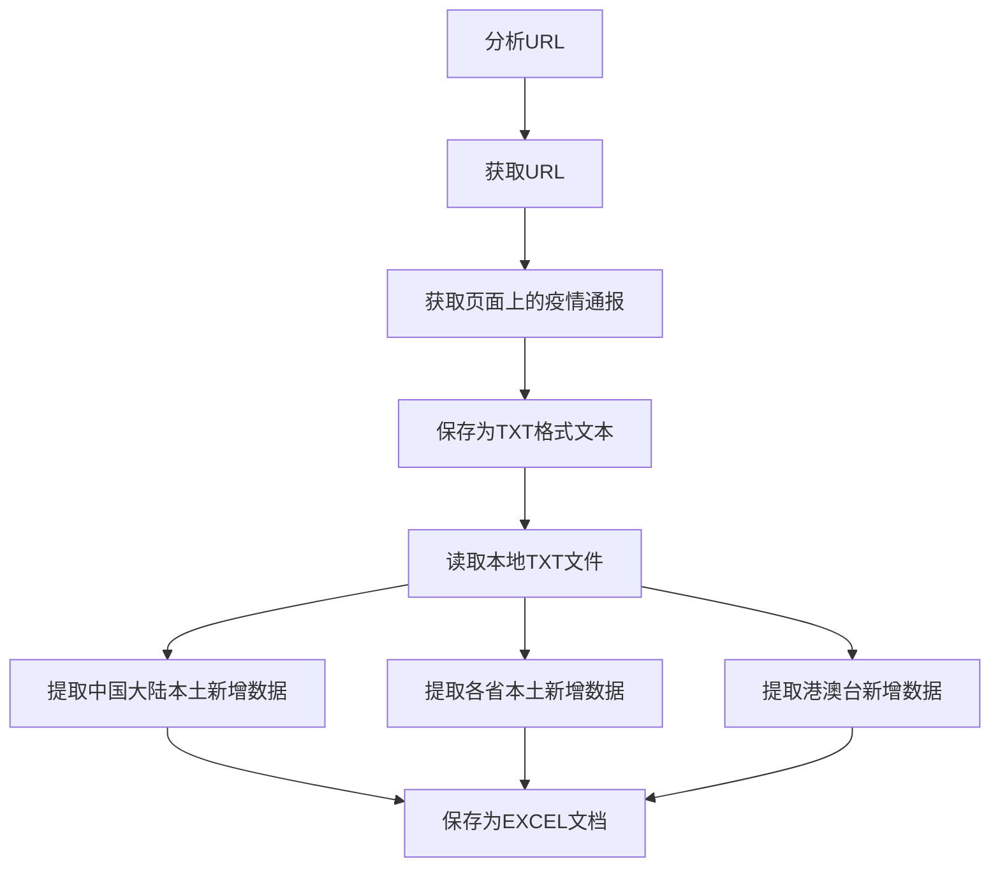

github链接：

[GodotHXB/SE_CoronaVirus (github.com)](https://github.com/GodotHXB/SE_CoronaVirus)

# 一、PSP表格

| PSP2.1                                  | Personal Software Process Stages        | 预估耗时（分钟） | 实际耗时（分钟） |
| --------------------------------------- | --------------------------------------- | ---------------- | ---------------- |
| Planning                                | 计划                                    | 30               | 30               |
| · Estimate                              | · 估计这个任务需要多少时间              | 30               | 30               |
| Development                             | 开发                                    | 1060             | 1470             |
| · Analysis                              | ·需求分析 (包括学习新技术)              | 150              | 300              |
| · Design Spec                           | · 生成设计文档                          | 30               | 50               |
| · Design Review                         | · 设计复审                              | 30               | 30               |
| · Coding Standard                       | · 代码规范 (为目前的开发制定合适的规范) | 10               | 10               |
| · Design                                | · 具体设计                              | 120              | 150              |
| · Coding                                | · 具体编码                              | 600              | 780              |
| · Code Review                           | · 代码复审                              | 30               | 30               |
| · Test                                  | · 测试（自我测试，修改代码，提交修改）  | 60               | 120              |
| Reporting                               | 报告                                    | 100              | 160              |
| · Test Repor                            | · 测试报告                              | 20               | 20               |
| · Size Measurement                      | · 计算工作量                            | 20               | 20               |
| · Postmortem & Process Improvement Plan | · 事后总结, 并提出过程改进计划          | 60               | 120              |
|                                         | · 合计                                  | 1190             | 1660             |

# 二、任务要求的实现

### 项目设计与技术栈

本次项目有关于爬取新冠肺炎疫情相关数据，我将本次任务分为以下环节：

 * 阅读题目，理解题意

* 划分需求模块
* 编写代码
* 测试并完善代码

 * 撰写博客

#### 阅读题目，理解题意

详细阅读任务需求的PDF文档，我将题目所需实现的要求列举如下：

* 利用**爬虫**爬取**卫健委**的疫情通报
* 在疫情通报中提取**中国大陆每日本土新增人数以及新增无症状感染者人数**
* 在疫情通报中提取**所有省份每日本土新增人数以及新增无症状感染者人数**
* 将统计的数据**利用编程工具或开发包自动写入Excel表中**
* 利用**爬取到的数据**以及**机器学习算法**实现每日热点功能
* 将爬取到的数据进行**数据可视化**

#### 划分需求模块

我将整个项目大致划分为以下四个模块：

* 爬虫进行疫情通报的爬取
* 利用正则表达式对疫情通报进行数据提取，并导出excel表格
* 每日热点功能
* 数据可视化

#### 编写代码

本次任务使用PyCharm进行代码的编写，共计代码**500+行**。

#### 测试并完善代码

在完成代码的大致编写后，对其进行测试，找到一些BUG，并对其进行修改。

#### 本次使用到的技术栈

* 编程语言：Python、HTML

* 编程工具：PyCharm、Git、Github、Anaconda
* 相关工具：Typora
* 相关第三方Python库：beautifulsoup4、pyppeteer、pandas、matplotlib

---

### 爬虫与数据处理

**本模块由corona_virus_detector.py与data_processing.py实现**

#### 业务逻辑



#### 代码设计过程

* 分析URL & 得到URL

  观察URL，发现卫健委疫情通报的每一页URL变化是有迹可循的。


​		可以看到第一页的URL结尾为list_gzbd.shtml，而第二页的URL结尾为list_gzbd_2，依此类推，**第N页的URL结尾为list_gzbd_n-1**。

故我们可以写出代码

```python
def get_url_in_page(page):
    # 获取列表里所有通报的不完整URL
    half_urls = {}
    if page == 1:
        script = get_page_souce('http://www.nhc.gov.cn/xcs/yqtb/list_gzbd.shtml')
    else:
        script = get_page_souce('http://www.nhc.gov.cn/xcs/yqtb/list_gzbd_' + str(page) + '.shtml')
```

* 得到URL

  打开网页的源代码，发现每一页上每天的疫情通报的URL都存放在一个属性为**zxxx_list**的标签中

  

​		但必须注意的是，此处存放的URL并不完整，还需要进行拼接。

```python
    # 得到不完整的URL
    urls_in_page = re.findall('<ul class="zxxx_list">.*?</ul>',script,re.DOTALL)
    half_urls = re.findall('href="(.*?)" target', urls_in_page[0], re.DOTALL)
    return half_urls
```

​		至此，我们就能得到所有页面的URL。

​		值得一提的是，卫健委的网站有着**十分强劲的防爬机制**，因此我们需要进行反爬操作。这里使用的是**第三方库pyppeteer**，进行模拟真实用户的访问来避免被防爬机制拦截。

```python
from pyppeteer import launch

async def pyppteer_fetchurl(url):
    browser = await launch({'headless': True, 'dumpio': True, 'autoClose': True})
    page = await browser.newPage()
    # 绕过浏览器检测
    await page.evaluateOnNewDocument('() =>{ Object.defineProperties(navigator,'
                                     '{ webdriver:{ get: () => false } }) }')
    await page.setUserAgent(
        'Mozilla/5.0 (Windows NT 10.0; Win64; x64) AppleWebKit/537.36 (KHTML, like Gecko) Chrome/105.0.0.0 Safari/'
        '537.36 Edg/105.0.1343.33')
    await page.goto(url)
    await asyncio.wait([page.waitForNavigation()],timeout=5)
    str = await page.content()
    await browser.close()
    return str


# 获取某一页面源代码
def get_page_souce(url):
    return asyncio.get_event_loop().run_until_complete(pyppteer_fetchurl(url))
```

* 获取页面上的疫情通报 & 保存为TXT格式文件

  获取了URL以后，下一步是对疫情通报里的信息进行提取。
  
  此部分需要提取**日期**以及**疫情通报正文**。打开任意一个疫情通报界面的源代码，查找发现**带有日期的标题**和**疫情通报正文**分别放在属性为**tit**和**con**的标签中。于是使用**第三方库BeautifulSoup生成BeautifulSoup对象**，再用其自带的find()函数提取其中的两段文本信息。获取到的标题再使用**正则表达式的findall()**得到具体日期。
  
  ```python
  # get_text()函数节选
  def get_text(half_urls, page):
      # 获取疫情通报
      count = 120 # 特判计数用，防重名
      for half_url in half_urls:
          page_script = get_page_souce('http://www.nhc.gov.cn' + half_url)
          soup = BeautifulSoup(page_script,'lxml')
          title_script = soup.find(attrs={"class":"tit"})
          title_script = title_script.text # 标题，用于获取时间
          page_script = soup.find(attrs={"class":"con"})
          text = page_script.text # 疫情通报正文
  ```
  
  值得注意的是，疫情初期的标题格式与现在的标题格式不同，无法提取日期，需要进行特判获取。
  
  最后将获得的疫情通报正文结合获得的日期结合，命名为**XXXX年X月X日疫情通报.txt**，保存到本地。
  
  

* 读取本地txt文件 & 进行数据提取 & 保存为EXCEL文档

  将疫情通报保存在本地后，需要打开疫情通报进行数据提取，最后保存为Excel文档。

  首先通过Python自带的os模块中的os.scandir()打开疫情通报数据所在文件夹，遍历该文件夹内的所有疫情通报文件进行数据提取。

  ```python
      # 打开文件进行数据提取，同时获取日期
      with open(file, 'r', encoding='utf-8') as fp:
          title = file.name
          date = re.findall("(.*?)疫情通报", title)[0]  # 得到日期
          print(date)
          text = fp.read()
  ```

  数据提取模块共计三个函数，分别为：

  * get_main_land_data()：用于提取**中国大陆本土疫情数据**。
  * get_province_data()：用于提取**各省本土疫情数据**。
  * get_special_area_data()：用于提取**港澳台地区疫情数据**。

  以上三个函数核心均为使用正则表达式提取数据，下面对其中一些特殊处理做解释：

  * 在get_main_land_data()函数中，疫情初期数据均为本土新增数据，但通报中未详细说明，因此引入一个函数load_special_days筛出疫情初期的特殊疫情通报list，并对这些疫情通报进行特殊处理：

    ```python
    def load_special_days():
        # 设置一个特殊日期list，处理疫情初期数据使用
    
     if date in special_days:
     	# 处理疫情初期数据
                newly_infected = re.findall("确诊病例(.*?)例", text, re.DOTALL)[0]
    ```

    由于早期疫情通报中对本土新增病例的描述为**"其中x例为本土新增病例"**，而非后期的**"本土病例x例"**，因此需要进行特殊处理，具体如下：

    ```python
        # 本土新增确诊
        try:
            # 处理疫情初期数据
            if date in special_days:
                newly_infected = re.findall("确诊病例(.*?)例", text, re.DOTALL)[0]
            else:
                context_newly_infected = re.findall("本土病例(.*?)例|其中(.*?)例为本土病例", text, re.DOTALL) # 匹配两种可能情况
                if(context_newly_infected[0][0] == ''): # 第一种没匹配上
                    newly_infected = context_newly_infected[0][1]
                else:
                    newly_infected = context_newly_infected[0][0]
    ```

    除此之外，我还注意到2020年4月份的格式也有所不同，为**"x例为本土病例"**，因此也对其进行特殊处理，具体如下：

    ```python
    # 解决2020年4月份特殊格式
          if context_newly_infected[0][1].isdigit() == False:
             newly_infected = re.findall("例为境外输入病例，(.*?)例", text, re.DOTALL)[0]
    ```

    对于新增无症状感染者，出现的情况更多，此处不做详细解释（代码上有注释可看）：

    ```python
        # 本土新增无症状感染者
        try:
            context_newly_infected_n = re.findall('新增无症状感染者.*?例(.*?）)', text, re.DOTALL)[0] # 本土新增无症状文本
            newly_infected_n_total = int(re.findall('新增无症状感染者(.*?)例.*', text, re.DOTALL)[0]) # 本土新增无症状总数
            try:
                newly_infected_n = int(re.findall("本土(.*?)例", context_newly_infected_n, re.DOTALL)[0]) # 直接匹配到本土病例
            except:
                # print("in here")
                out_side_in_judge = re.findall('（.*?）', context_newly_infected_n, re.DOTALL)[0]
                out_side_in = re.findall('（境外输入(.*?)例）|境外输入无症状感染者(.*?)例', context_newly_infected_n, re.DOTALL) # 匹配两种可能情况
                if (out_side_in[0][0] == ''):
                    out_side_in = int(out_side_in[0][1])
                else:
                    out_side_in = int(out_side_in[0][0])
            # 处理只有境外输入数据情况
            if newly_infected_n != 0:
                pass
            # 处理境外输入X例情况
            elif newly_infected_n == 0 and out_side_in != 0:
                newly_infected_n = newly_infected_n_total - out_side_in
            # 处理均为境外输入情况
            elif out_side_in_judge == '均为境外输入':
                newly_infected_n = 0
            # 处理无境外输入
            elif out_side_in_judge == '无境外输入':
                newly_infected_n = newly_infected_n_total
    ```

  * 在get_province_data()函数中，建立了一个包含所有省份的list，方便后续分类使用：

    ```python
     # 建立包含所有省份的list，以便后续分类使用
        provinces = ['河北', '山西', '辽宁', '吉林', '黑龙江', '江苏', '浙江', '安徽', '福建', '江西', '山东', '河南', '湖北', '湖南', '广东', '海南',
                     '四川', '贵州', '云南', '陕西', '甘肃', '青海', '内蒙古', '广西', '西藏', '宁夏', '新疆', '北京', '天津', '上海', '重庆']
    ```

    提取数据的正则表达式使用了`[\u4E00-\u9FA5]+?`来匹配省份信息：

    ```python
            province_name = re.findall("([\u4E00-\u9FA5]+?)[0-9]*?例", context_newly_infected, re.DOTALL)
            province_count = re.findall('[\u4E00-\u9FA5]+?([0-9]*?)例', context_newly_infected, re.DOTALL)
    ```

    并按照省份list来记录数据：

    ```python
    # 按照省份list计入数据
            for province in province_name:
                if province in provinces:
                    by_province_n[province] = province_count[i]
                    i = i + 1
                else:
                    i = i + 1
    ```

  * get_special_area_data()函数中，注意到疫情通报中，对港澳台地区名称的描述存在不一致的情况，于是进行多重匹配：

    ```python
    total_infected_g = re.findall('(中国香港|香港特别行政区)(.*?)例', total_infected, re.DOTALL)[0][1]
            total_infected_a = re.findall('(中国澳门|澳门特别行政区)(.*?)例', total_infected, re.DOTALL)[0][1]
            total_infected_t = re.findall('(中国台湾|台湾地区)(.*?)例', total_infected, re.DOTALL)[0][1]
    ```

  

  **:warning:似乎存在一些特殊情况，例如：疫情初期的新增确诊并未写明新增病例来自哪个省份，疫情初期还未出现无症状感染者概念，因此早期的一些数据无法提取（这也没法解决）。**


​		每个函数处理结束后，都将数据导出为Excel文件，保存在对应文件夹中，以供**数据可视化**部分使用。


---

### 数据统计接口部分的性能改进

这一部分我选用的是**PyCharm自带的图形化测试工具Profile**，完整的性能分析图如下：


通过分析图可知，本数据统计的接口部分运行所花费的时间为93918ms，即93.918秒。


花销最大的函数为to_excel函数，运行时间为91635ms，即91.635秒，占到总运行时间的97.6%。


改进思路：目前的做法是将每一天的数据都导出成一个单独的表格，导致一共要导出3908个表格，但最后还要将这些表格合并成一个表格。**若改为将每个月甚至每一年的数据一起导出，应该能大幅减少运行时间。**

---

### 每日热点的实现思路

本部分使用**LSTM(Long Short Term Memory)神经网络**，它是具有记忆长短期信息的能力的神经网络。

未做到代码实现，但可以描述一下我的实现思路：

我们认为新增无症状感染者与新增确诊人数间有着一定的关系。于是我们就可以使用LSTM通过新增无症状感染者人数来**预测新增确诊人数**，取部分新增无症状感染者数据进行训练，将训练结果与同日的真实的新增确诊人数进行对比，并进行多轮训练获取更佳的效果。

在训练结束后使用训练好的模型来预测新增确诊人数，**找出其中偏离较大的日期**，例如模型预测的新增数远小于或远大于实际新增数的日期，就说明当日出现了一些变故使得预测结果不准确。**这样就能实现热点的挖掘。**

LSTM的优点：由于有记忆能力，对于解决**预测疫情发展**这种时间序列问题效果较好。

LSTM的缺点：计算时间较长，对于数据量较大的数据集训练困难。

---

### 数据可视化界面的展示

**本模块由data_visualization.py实现**

本模块使用到了Python的**第三方库matplotlib**，通过其与提取到的疫情数据生成可视化数据图。

本模块共计五个函数，分别为：

* make_mainland_newly_infected()：生成**大陆本土新增确诊病例**数据图。
* make_mainland_newly_infected_n()：生成**大陆本土新增无症状感染者**数据图。
* make_province_newly_infected()：生成**各省份某日本土新增确诊病例**数据图。
* make_province_newly_infected_n()：生成**各省份某日本土新增无症状感染者**数据图。
* make_special_area_infected()：生成**港澳台地区累计确诊病例**数据图

并实现了使用菜单选择所想生成的图片类型，示例如下：


下面对生成的数据图进行展示：

* 中国大陆本土新增确诊病例：


* 中国大陆本土新增无症状感染者：


* 各省份某日本土新增确诊（以2021年12月3日为例）：


* 各省份某日本土新增无症状感染者（以2022年8月16日为例）：


* 港澳台累计确诊病例（以香港为例）：


# 三、心得体会

* 首先可以说**难！得！我！想！吐！**吗

* 难归难，不过确实**学到很多东西**。在过去的两周时间里，我从一个只会Python语法基础的菜鸟，到现在：

  * **会写爬虫（甚至学会了解决反爬）**

  * **会用正则表达式提取信息（虽然提得还不是很熟练）**

  * **会用Python批量处理本地文件**

  * **会用matplotlib做一些基础的数据可视化**

  * 甚至还**提高了我遇到问题-->搜资料-->开始自学-->解决问题的能力**。

    虽然这个题目确实很难很难很难（~~难到有时候我真的想一头创死自己~~），但是还是**收获满满~**

* 回头看PSP表格，发现本次编程作业花费的时间大多在**学习新技术**与**具体编码**上，看来自己的代码能力还有待提高。第一篇博客里说**一周只花六个小时在这门课上**属于是在开玩笑了，现在看来**一周十二个小时**都不在话下...
